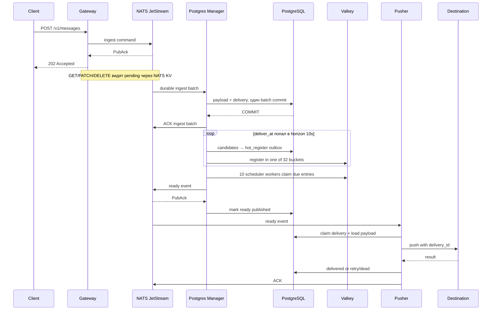

# DeferMQ

DeferMQ — прототип open-source брокера отложенных сообщений. Клиент задаёт
`deliver_at`, а DeferMQ доставляет payload в HTTP, Kafka, RabbitMQ или PostgreSQL.

Путь новой команды короткий: **Gateway → durable NATS ingest → пакетная запись в
PostgreSQL**. Расписание живёт в PostgreSQL, ближайшие события индексируются в
Valkey, а NATS используется только для ingest и ready events.

> Статус проекта: **prototype**. API, схема данных и operational defaults могут
> меняться до первого стабильного релиза.

## Гарантии доставки

1. Gateway возвращает `202 Accepted` только после JetStream `PubAck`. В этот
   момент команда уже durable в ingest stream, но batch writer может ещё не
   записать её в PostgreSQL.
2. После commit PostgreSQL становится source of truth для delivery и payload.
   До commit API читает временное pending-состояние из NATS KV.
3. Ingest consumer отправляет ACK только после успешного commit PostgreSQL.
   При ошибке commit команда остаётся в JetStream и выдаётся повторно.
4. DeferMQ намеренно не отправляет сообщение раньше `deliver_at`. После этого
   времени возможна положительная задержка из-за нагрузки или недоступности систем.
5. Семантика доставки — **at-least-once**. Повтор возможен, если destination принял
   сообщение, а Pusher завершился до записи результата в PostgreSQL.
6. Стабильный `delivery_id` передаётся downstream как idempotency key.
7. Transactional outbox защищает границу PostgreSQL → ready NATS; `schedule_revision`
   отсекает устаревшие события после отмены или переноса.
8. Valkey — восстанавливаемый быстрый индекс, а не источник данных. Repairer
   заново наполняет его из PostgreSQL.
9. Потеря ready events NATS восстанавливается overdue reconciliation из
   PostgreSQL. Потеря PostgreSQL после ingest commit без резервной копии необратима.

Exactly-once для произвольных внешних систем не обещается. Получатель должен
дедуплицировать запросы по `delivery_id`.

## Архитектура



Три исполняемых файла имеют разные роли:

- `defermq-gateway` — REST API, валидация и публикация create/cancel/reschedule
  команд в durable ingest stream. Для idempotency и pending API он использует
  стабильные ID и NATS KV.
- `defermq-postgres-manager` — batch ingest writer, promotion в hot horizon,
  регистрация и планирование через Valkey, ready outbox, repair/reconciliation,
  reaping leases и retention.
- `defermq-pusher` — durable pull consumers, PostgreSQL claim, worker pools,
  destination adapters, application retries и terminal state.

### Hot horizon

Далёкая delivery хранится только в PostgreSQL. За
`DEFERMQ_HOT_HORIZON=10s` до срока Manager создаёт `hot_register` outbox и
регистрирует delivery в одном из `DEFERMQ_VALKEY_BUCKETS=32` стабильных buckets.
По умолчанию `DEFERMQ_MANAGER_SCHEDULER_WORKERS=10` workers делят buckets между
собой, забирают наступившие записи и публикуют только ready event.

В Valkey нет payload. Если Valkey очищен или перезапущен, repairer восстанавливает
индекс из PostgreSQL. NATS не используется как таймер: в нём есть только durable
ingest commands, временный pending KV и ready events.

### Окна отказов

- **До PubAck:** Gateway не возвращает `202`. Клиент повторяет запрос с тем же
  `Idempotency-Key`.
- **После PubAck, до ответа HTTP:** результат для клиента неоднозначен. Повтор с
  тем же ключом безопасен: delivery ID вычисляется стабильно.
- **После `202`, до commit PostgreSQL:** GET возвращает pending-представление из
  NATS KV. PATCH и DELETE публикуют следующую команду в тот же стабильный shard,
  поэтому порядок одной delivery сохраняется.
- **Ошибка PostgreSQL до commit:** ingest writer делает NAK; команда будет выдана
  снова. В PostgreSQL нет частично записанного batch.
- **Commit прошёл, ACK потерян:** JetStream может повторить команду. Запись в
  PostgreSQL идемпотентна, поэтому повтор не создаёт вторую delivery.
- **Valkey недоступен:** durable расписание остаётся в PostgreSQL, но ready
  публикация задерживается. После восстановления repairer и overdue reconciler
  возвращают работу.
- **Ready PubAck получен, но PostgreSQL ещё не обновлён:** возможен повтор ready
  event. Pusher проверяет `schedule_revision` и состояние в PostgreSQL.
- **Destination принял запрос, а запись результата не завершилась:** внешняя
  доставка может повториться. Получатель обязан дедуплицировать по `delivery_id`.

## Требования

- Docker Engine 28+ и Docker Compose v2 для рекомендуемого запуска;
- либо Go 1.26.x, PostgreSQL, NATS Server 2.12+ и Valkey 8+ для локальной разработки;
- Task 3.x (`task`) для developer-команд.

SQL-миграции встроены в бинарники и применяются при
`DEFERMQ_POSTGRES_AUTO_MIGRATE=true`; контейнеру не нужен каталог migrations.

## Быстрый запуск из исходников

```bash
git clone https://github.com/defermq/defermq.git
cd defermq
cp .env.example .env
docker compose -f deploy/compose/docker-compose.build.yml up --build -d
docker compose -f deploy/compose/docker-compose.build.yml ps
```

Core-профиль запускает source PostgreSQL, NATS, Valkey и три DeferMQ-сервиса. Порты
публикуются только на loopback:

- Gateway: `http://127.0.0.1:8080`;
- Manager admin: `http://127.0.0.1:8081`;
- Pusher admin: `http://127.0.0.1:8082`;
- NATS monitoring: `http://127.0.0.1:8222`.
- Valkey: `127.0.0.1:6379`.

Остановка сохраняет persistent volumes:

```bash
docker compose -f deploy/compose/docker-compose.build.yml down
```

Для полного удаления локальных данных добавьте `--volumes`.

## Запуск готовых images

В `.env` замените три значения `DEFERMQ_*_IMAGE` на опубликованные образы:

```bash
cp .env.example .env
# DEFERMQ_GATEWAY_IMAGE=registry.example.com/team/defermq-gateway:v0.1.0
# DEFERMQ_POSTGRES_MANAGER_IMAGE=registry.example.com/team/defermq-postgres-manager:v0.1.0
# DEFERMQ_PUSHER_IMAGE=registry.example.com/team/defermq-pusher:v0.1.0
docker compose -f deploy/compose/docker-compose.images.yml pull
docker compose -f deploy/compose/docker-compose.images.yml up -d
```

`docker-compose.images.yml` не содержит `build:` и использует ту же сеть,
конфигурацию, healthchecks и volumes, что build-вариант.

## API

Время принимается в RFC3339/RFC3339Nano и приводится к UTC. Создание возвращает
`202 Accepted`. Подставьте будущее значение `deliver_at`:

```bash
curl --fail-with-body -i http://127.0.0.1:8080/v1/messages \
  -H 'Content-Type: application/json' \
  -H 'Idempotency-Key: invoice-inv-123-overdue-v1' \
  -d '{
    "deliver_at": "2030-07-25T14:00:00Z",
    "max_attempts": 10,
    "destination": {
      "type": "http",
      "http": {
        "url": "https://webhook.example.com/defermq",
        "method": "POST",
        "headers": {"X-Event-Type": "invoice.overdue"}
      }
    },
    "payload": {
      "content_type": "application/json",
      "body": {"invoice_id": "inv-123"}
    }
  }'
```

Повтор с тем же `Idempotency-Key` возвращает существующую delivery и
`Idempotent-Replay: true`. Глобальная уникальность ключа — ограничение прототипа.

Сразу после `202` статус может ещё не существовать в PostgreSQL. Это нормально:
`GET /v1/messages/{id}` сначала проверяет PostgreSQL, затем pending-состояние в
NATS KV. Ответ имеет ту же форму и обычно содержит `status: scheduled`. После
batch commit Gateway удаляет устаревшую pending-запись при следующем чтении.

```bash
DELIVERY_ID=0198f4f4-1b9e-7d3e-9c65-96c7af740db1
curl --fail-with-body "http://127.0.0.1:8080/v1/messages/${DELIVERY_ID}"

curl --fail-with-body -X PATCH \
  "http://127.0.0.1:8080/v1/messages/${DELIVERY_ID}/schedule" \
  -H 'Content-Type: application/json' \
  -d '{"deliver_at":"2030-07-26T10:00:00Z"}'

curl --fail-with-body -X DELETE \
  "http://127.0.0.1:8080/v1/messages/${DELIVERY_ID}"
```

Перенос и отмена разрешены только для `scheduled`. Обе операции увеличивают
`schedule_revision`, поэтому уже выпущенные NATS events становятся stale.

Для binary payload передайте ровно один `body_base64`:

```json
{
  "payload": {
    "content_type": "application/octet-stream",
    "body_base64": "AAECAwQ="
  }
}
```

### Destination: Kafka

Запустите broker, затем в `.env` установите
`DEFERMQ_KAFKA_ENABLED=true` и добавьте `kafka` в
`DEFERMQ_ENABLED_DESTINATIONS`. Перезапустите Pusher/Gateway.

```bash
docker compose -f deploy/compose/docker-compose.build.yml --profile kafka up --build -d
```

```json
{
  "type": "kafka",
  "kafka": {
    "topic": "billing-events",
    "key": "inv-123",
    "headers": {"event_type": "invoice.overdue"}
  }
}
```

Brokers и TLS/SASL credentials задаются глобально через env. Если key пуст,
используется delivery ID. Producer ожидает подтверждение и передаёт idempotency
metadata в headers.

### Destination: RabbitMQ

Установите `DEFERMQ_RABBIT_ENABLED=true`, добавьте `rabbit` в разрешённые
destinations и запустите профиль:

```bash
docker compose -f deploy/compose/docker-compose.build.yml --profile rabbit up --build -d
```

```json
{
  "type": "rabbit",
  "rabbit": {
    "exchange": "events",
    "routing_key": "billing.invoice.overdue",
    "headers": {"event_type": "invoice.overdue"}
  }
}
```

Pusher отправляет persistent messages и признаёт успех только после publisher
confirm. Demo management UI доступен на `127.0.0.1:15672`.

### Destination: PostgreSQL

Установите `DEFERMQ_TARGET_POSTGRES_ENABLED=true`, добавьте `postgres` в
разрешённые destinations и запустите профиль:

```bash
docker compose -f deploy/compose/docker-compose.build.yml --profile target-postgres up --build -d
```

```json
{
  "type": "postgres",
  "postgres": {
    "channel": "billing",
    "metadata": {"source": "defermq-demo"}
  }
}
```

Adapter выполняет параметризованный `INSERT` в фиксированную таблицу
`DEFERMQ_TARGET_POSTGRES_TABLE` с `ON CONFLICT (delivery_id) DO NOTHING`.
Произвольный SQL от API не принимается.

## Retry semantics

Pusher увеличивает `attempts` во время atomic claim. Network errors, timeout,
HTTP 408/425/429/5xx и временные ошибки adapters повторяются с bounded exponential
backoff и jitter. `Retry-After` для HTTP 429/503 учитывается в пределах max
backoff. Остальные HTTP 4xx и ошибки постоянной конфигурации переводят delivery в
`dead`. Каждый retry получает новую revision и новый `deliver_at`.

JetStream `AckWait` не используется как application scheduler. ACK отправляется
только после commit состояния `delivered`, `scheduled` (retry) или `dead`.
Истёкший processing lease возвращается Manager-ом в очередь.

Downstream получает следующие логические поля:

- `Idempotency-Key` / `X-DeferMQ-Delivery-ID`;
- `X-DeferMQ-Schedule-Revision`;
- `X-DeferMQ-Attempt`;
- `X-DeferMQ-Scheduled-At`.

Kafka и RabbitMQ получают эквивалентные headers; target PostgreSQL имеет
`delivery_id UUID PRIMARY KEY`.

## Health и метрики

У каждого бинаря доступны `GET /livez`, `GET /readyz` и `GET /metrics`.
Liveness не обращается к сети. Readiness проверяет необходимые зависимости:
Gateway — PostgreSQL, NATS и schema; Manager — PostgreSQL, NATS, Valkey,
совместимость stream и heartbeat критических loops; Pusher — PostgreSQL, NATS,
consumers и включённые глобальные adapters.

Prometheus scrape targets:

```text
127.0.0.1:8080/metrics  # gateway
127.0.0.1:8081/metrics  # manager
127.0.0.1:8082/metrics  # pusher
```

Основные группы метрик:

- Gateway: HTTP rate/latency/size, created/replayed/cancelled/rescheduled;
- Manager ingest: размер batch, commit latency/result/rows, redelivery и DLQ;
- Manager scheduling: promoter/registrar/scheduler/repairer, Valkey errors,
  sampled depth `schedule`/`inflight` buckets и wake lag;
- Manager recovery: ready outbox, overdue/reaper/retention,
  `unpromoted_headroom_seconds`, pending и oldest outbox;
- Pusher: received/claims/attempts/retries/dead, inflight, start/completion lag,
  early events и consumer pending;
- все сервисы: `defermq_build_info`, dependency readiness, Go/process и pgxpool.

`/metrics` не выполняет SQL: DB/NATS gauges обновляют фоновые collectors.
Практичные alerts: readiness дольше нескольких минут; ingest commit errors,
redeliveries или DLQ растут; pending/oldest ready outbox растёт; Valkey errors или
scheduler wake lag растут; unpromoted headroom приближается к нулю; processing
expired > 0; delivery lag/dead rate растёт; metrics collector success равен 0.

## Конфигурация

Полный каталог переменных с русскими комментариями находится в `.env.example`.
Особенно важны группы `DEFERMQ_GATEWAY_INGEST_*`,
`DEFERMQ_MANAGER_INGEST_*`, `DEFERMQ_NATS_INGEST_*`,
`DEFERMQ_VALKEY_*`, `DEFERMQ_MANAGER_SCHEDULER_*` и
`DEFERMQ_HOT_HORIZON`. Общие stream/subject, horizon и payload limits должны
совпадать между процессами. Credentials передавайте через secret manager или
mounted files, а не коммитьте в `.env`.

Manager по умолчанию запускает 8 ingest writers для 32 shard subjects. Writer
`N` единолично читает shards, для которых `shard % workers == N`; отдельный
durable consumer с несколькими `FilterSubjects` сохраняет stream order этого
набора. Поэтому `DEFERMQ_MANAGER_INGEST_SHARDS` должен совпадать с
`DEFERMQ_GATEWAY_INGEST_SHARDS`, а число writers не может превышать число shards.
Каждый writer накапливает до `DEFERMQ_MANAGER_INGEST_BATCH_SIZE=500` команд или
делает commit через `DEFERMQ_MANAGER_INGEST_FLUSH_INTERVAL=500ms` после первой
команды; `DEFERMQ_MANAGER_INGEST_MAX_ACK_PENDING=2000` оставляет запас для
неподтверждённых batch. Настройки Gateway остаются `100` команд и `100ms`.

При обновлении со старого wildcard consumer нельзя одновременно запускать
старый и sharded Manager: оба набора durable consumers прочитают одни команды.
Сначала остановите все Manager старой версии. Затем на одном запуске новой
версии задайте `DEFERMQ_MANAGER_INGEST_DELETE_LEGACY_DURABLE=true`, чтобы удалить
durable из `DEFERMQ_MANAGER_INGEST_DURABLE`; после успешного старта верните
значение `false`. Новые consumers начинают с legacy `AckFloor + 1`, включая все
ранее неподтверждённые команды. Без явного разрешения новая версия обнаружит
legacy consumer и завершит запуск с ошибкой, не создавая sharded consumers.

## Разработка

```bash
task --list
task deps
task fmt
task vet
task unit
task fault
task lint
task build
task test-integration
task test-e2e
task full
task config-check
task load-smoke
# Нагрузочный профиль, запускайте только осознанно:
task load-1000rps
```

`task lint` ожидает `golangci-lint` в `PATH`; migration tasks — `goose`.
`task full` не запускает load test, но ожидает уже поднятый Compose для core
integration и E2E. `task fault` — быстрые детерминированные проверки ключевых
окон отказов; это не chaos test с остановкой контейнеров. Integration tests могут
требовать Docker. Отдельные команды:

- `DEFERMQ_TEST_POSTGRES_DSN` включает repository integration tests;
- `DEFERMQ_NATS_INTEGRATION_URL` включает JetStream scheduling test;
- `DEFERMQ_TEST_KAFKA_*`, `DEFERMQ_TEST_RABBIT_*` и
  `DEFERMQ_TEST_TARGET_POSTGRES_DSN` включают adapter tests;
- `DEFERMQ_E2E_GATEWAY_URL=http://127.0.0.1:8080` включает HTTP E2E для
  запущенных локально Gateway, Manager и Pusher
  (`DEFERMQ_HTTP_ALLOW_PRIVATE_NETWORKS=true`).

```bash
task build-gateway
task build-manager
task build-pusher
task run-gateway
task run-manager
task run-pusher
task migrate-up
task migrate-status
```

Build information (`version`, `commit`, `build time`) передаётся через ldflags и
публикуется в liveness/startup logs/`defermq_build_info`.

Подробная пирамида тестов, fault-проверки, параметры распределений, resource
sampling, assertions и формат load-test отчёта описаны в
[TESTING.MD](TESTING.MD).

## Security

- Demo-пароли и разрешение private HTTP networks небезопасны для production.
  Замените credentials, установите `DEFERMQ_HTTP_ALLOW_PRIVATE_NETWORKS=false`
  и задайте `DEFERMQ_HTTP_ALLOWED_HOSTS`.
- Простой DNS validator не устраняет DNS rebinding полностью. Ограничьте egress
  на уровне сети.
- NATS demo не имеет auth/TLS и публикуется Compose только на loopback. Для
  внешней сети настройте NATS accounts/credentials и TLS.
- Admin endpoints, включая optional pprof, требуют сетевого ACL или reverse proxy
  с аутентификацией. Не публикуйте pprof в Internet.
- Не логируются payload, DSN, credentials и sensitive headers. Всё равно
  контролируйте доступ к stdout и Prometheus.
- Используйте TLS для PostgreSQL, NATS, Kafka, RabbitMQ и HTTP destinations вне
  доверенной локальной сети; регулярно делайте backup source PostgreSQL.
- Контейнеры запускаются non-root, с read-only root filesystem и
  `no-new-privileges`.

## Ограничения прототипа

- Нет пользовательской авторизации, multi-tenancy, quotas, billing и UI.
- Нет recurring/cron messages и массовых кампаний.
- Нет exactly-once для внешних HTTP/Kafka/RabbitMQ; возможен ambiguous success.
- После ingest commit PostgreSQL — единственный cold storage backend и единая
  точка сохранности; до commit durable команда хранится в NATS.
- Pending API опирается на NATS KV с ограниченным TTL и не заменяет PostgreSQL.
- Valkey не хранит payload и может быть восстановлен, но его отказ увеличивает
  задержку ready delivery.
- Payload целиком читается в память, но ограничен `DEFERMQ_MAX_PAYLOAD_BYTES`.
- Exact DB counts фоновых metrics collectors могут стать дорогими на очень
  больших таблицах.
- HTTP SSRF-защита не является полноценной защитой от DNS rebinding.
- Kafka/RabbitMQ/target PostgreSQL в Compose предназначены для локальной проверки,
  а не production deployment.
- Kubernetes/Helm, distributed tracing, OAuth и dynamic plugins не входят в scope.

## Лицензия

Проект распространяется по лицензии MIT. См. [LICENSE](LICENSE).
